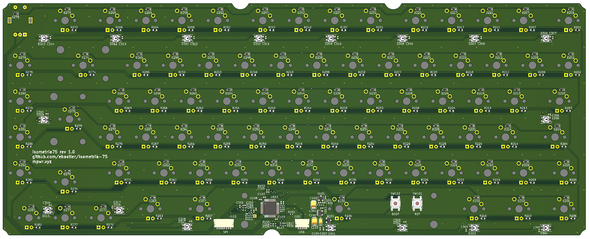
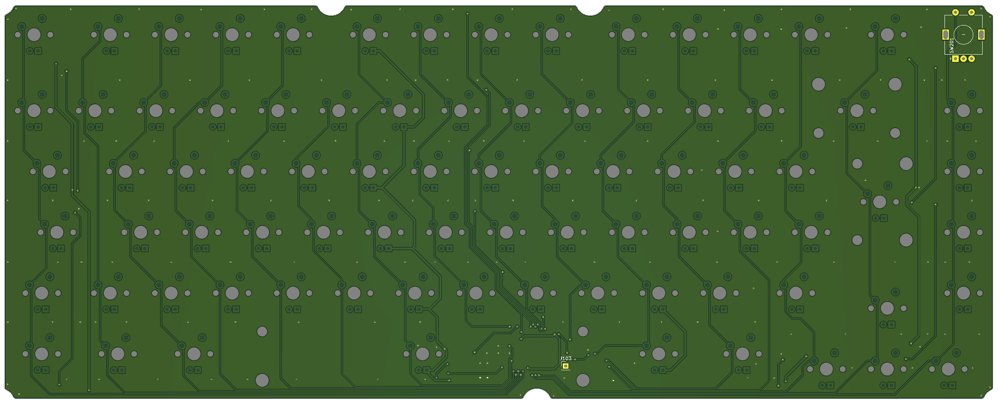

# isometria75

The first prototype is sitting on my desk and works perfectly - clearance for weights and battery is currently wrong, so the intended battery will not fit in the case.

----
 
 The name isometria75 has it's origin in the greek noun ἰσομετρία (in latin letters: isometria), meaning "equality of measure" [[1]](http://perseus.uchicago.edu/cgi-bin/philologic/getobject.pl?c.35:6:59.LSJ). This word ended up being included in various languages, among them english (isometric), with the same meaning. I chose it for two reasons - because this keyboard is only available in an ISO layout (sorry ANSI users - for once it is ne ANSI avail), but also, because I paid attention to only use u/4 spaces throughout my board. You will have a hard time finding any distance on it that's not a multiple of 4.75 mm.

|||
|:----------------------------------------:|:----------------------------------------:|
|||
|||

 ## Features
 * CNC'd top shell with integrated 3 mm plate (obviously, with cutouts for switch retention and PCB mount stabs)
 * 6.8° typing angle
 * The PCB is equipped to fit 82 cherry MX-style switches
 * One 3 mm LED per switch (monochrome, dimmable only as one group)
 * 17 SK6812 Mini can be soldered to the bottom of the board for underglow
 * Fits either a battery-management or a simple USB-C daughterboard ([Repo link](https://github.com/ebastler/unified-usb-pcb))
 * A rotary encoder sits in the top right corner and the push-button is wired to the controller (Row 0 Column 15)
 * The USB-C connector is placed on a small PCB on it's own, which can be replaced by a battery management board
 * Sense wires to measure the input voltage and to check if the battery is currently being charged
 * A STM32F072CBT6 controller with native crystal-less USB and a lot of IO for various things
 * An SPI interface is wired to a second connector, allowing for a SPI Bluetooth LE board to be added
 * One leftover GPIO is available on a header - if you want to add something yourself

## Design
The PCB uses a key spacing of 19 mm (instead of the default 19.05), and all delimiters between key-blocks, or keys and the border of the case are 4.75 or 9.5 mm wide. This allows for a pleasantly homogenous design, which earned the keyboard it's name. Sadly, this layout requires a 1.5u right shift, which very few sets include. 

The bottom shell breaks the minimalist design of the top shell a little, with "stepped" faces. While the design originated from the need to make it easily millable on a 3 axis CNC, I appreciate the fact that it makes the board visually a bit more interesting.

## Geekhack project thread
https://geekhack.org/index.php?topic=106060.msg2896354

## FAQ:
 * Where can I buy this?

   I'm afraid there will not be any groupbuy nor will it be stocked at some reseller - All files are open source though, feel free to order a batch of PCBs and a case yourself - or improve it!

 * When will there be an ANSI version?

   Even though I planned not to do ANSI, I actually went with multi-layout for v2! Stay tuned!

 * Why did you clone the Evolv/Satisfaction?
 
   I made my own design choices, and designed everything from scratch - however the evolv heavily influenced my design. I fell in love with it the first time I saw it, but it had a few things I dislike. So I decided to mostly adopt it's layout with some changes, and design a case which follows my design ideals - ending up with a (visually) very similar top enclosure - The standalone-features of the evolv are it's premium materials, construction and generative design, and I did not include either.

For any other questions, or problems with my board (if you decided to build one yourself) - feel free to contact me. I'm idling around and occasionally check my PMs on freenode (ebastler), am active on reddit (the_ebastler) and on discord (ebastler#8966).

## Big thanks to:
 - ai03 for both his [great tutorial](https://wiki.ai03.me/books/pcb-design/chapter/pcb-designer-guide) as well as his various footprints I used in my design - I don't know if I had been able to design this without his help.
 - The awesome people on grabcad for the [MX switch](https://grabcad.com/library/cherry-mx-switches-mx-1), [Cherry Stab](https://grabcad.com/library/cherry-mx-stabilizer-mx-1) and [pushbutton](https://grabcad.com/library/5mm-button-switch-1) models, [JST SH models](https://grabcad.com/library/jst-sh-smd-connectors-1/details?folder_id=3903823) and [WS2812 Mini models](https://grabcad.com/library/smd-ws2812b-led-1) which made my design a whole lot easier, and my renders prettier.
  - People on the MechKeys and Mechanische Tastaturen Deutschland discord servers who tirelessly answered my questions - from the noobiest to the most complicated ones.
  - [Propagandalf1](https://github.com/Propagandalf1) for all the advise, criticism and ideas for improvement
  - Pseudoephedrin and Lux for checking my PCB layouts for errors
  - Hendrik for milling my proto